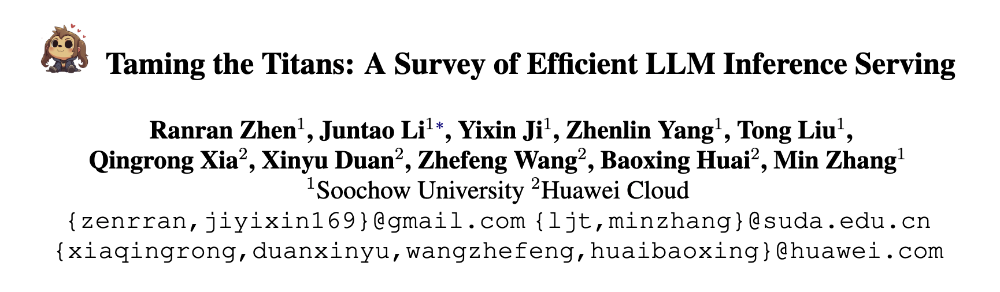
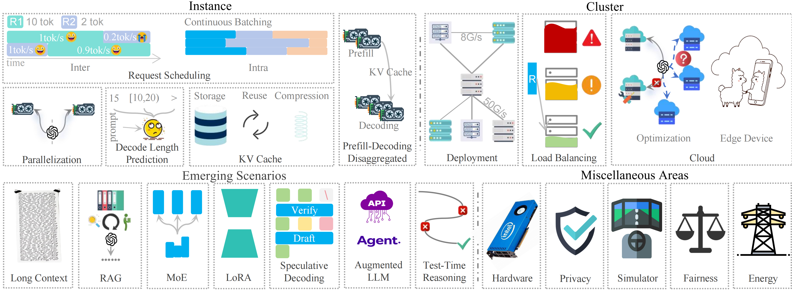

<div align="center">
<h1>Awesome LLM Inference Serving</h1>
</div>



This repository contains the literature referenced in [Taming the Titans: A Survey of Efficient LLM Inference Serving](https://arxiv.org/abs/2504.19720), and will be updated regularly.

<!--## Table of Contents-->

## Table of Contents

- [Table of Contents](#table-of-contents)
- [LLM Inference Serving in Instance](#llm-inference-serving-in-instance)
  - [Model Placement](#model-placement)
    - [Model Parallelism](#model-parallelism)
    - [Offloading](#offloading)
  - [Request Scheduling](#request-scheduling)
    - [Inter-Request Scheduling](#inter-request-scheduling)
    - [Intra-Request Scheduling](#intra-request-scheduling)
  - [Decoding Length Prediction](#decoding-length-prediction)
    - [Exact Length Prediction](#exact-length-prediction)
    - [Range-Based Classification](#range-based-classification)
    - [Relative Ranking Prediction](#relative-ranking-prediction)
  - [KV Cache Optimization](#kv-cache-optimization)
    - [Memory Management](#memory-management)
    - [Reuse Strategies](#reuse-strategies)
    - [Compression Techniques](#compression-techniques)
  - [PD Disaggregation](#pd-disaggregation)
- [LLM Inference Serving in Cluster](#llm-inference-serving-in-cluster)
  - [Cluster Optimization](#cluster-optimization)
    - [Architecture and Optimization for Heterogeneous Resources](#architecture-and-optimization-for-heterogeneous-resources)
    - [Service-Aware Scheduling](#service-aware-scheduling)
  - [Load Balancing](#load-balancing)
    - [Heuristic Algorithm](#heuristic-algorithm)
    - [Dynamic Scheduling](#dynamic-scheduling)
    - [Intelligent Predictive Scheduling](#intelligent-predictive-scheduling)
  - [Cloud-Based LLM Serving](#cloud-based-llm-serving)
    - [Deployment and Computing Effective](#deployment-and-computing-effective)
    - [Cooperation with Edge Device](#cooperation-with-edge-device)
- [Emerging Scenarios](#emerging-scenarios)
  - [Long Context](#long-context)
    - [Parallel Processing](#parallel-processing)
    - [Attention Computation](#attention-computation)
    - [KV Cache Management](#kv-cache-management)
  - [RAG](#rag)
    - [Workflow Scheduling](#workflow-scheduling)
    - [Storage Optimization](#storage-optimization)
  - [MoE](#moe)
    - [Expert Placement](#expert-placement)
    - [Expert Load Balancing](#expert-load-balancing)
    - [All-to-All Communication](#all-to-all-communication)
  - [LoRA](#lora)
  - [Speculative Decoding](#speculative-decoding)
  - [Augmented LLMs](#augmented-llms)
  - [Test-Time Reasoning](#test-time-reasoning)
- [Miscellaneous Areas](#miscellaneous-areas)
  - [Hardware](#hardware)
  - [Privacy](#privacy)
  - [Simulator](#simulator)
  - [Fairness](#fairness)
  - [Energy](#energy)
- [Reference](#reference)

## LLM Inference Serving in Instance

### Model Placement

#### Model Parallelism

- **GPipe: Efficient Training of Giant Neural Networks using Pipeline Parallelism** [arxiv 2019.7] [paper](https://arxiv.org/abs/1811.06965)
- **PipeDream: Fast and Efficient Pipeline Parallel DNN Training** [arxiv 2018.6] [paper](https://arxiv.org/abs/1806.03377)
- **Efficient Large-Scale Language Model Training on GPU Clusters Using Megatron-LM** [arxiv 2021.4] [paper](https://dl.acm.org/doi/abs/10.1145/3458817.3476209) [code](https://github.com/nvidia/megatron-lm)
- **Megatron-LM: Training Multi-Billion Parameter Language Models Using Model Parallelism** [arxiv 2020.3] [paper](https://arxiv.org/abs/1909.08053) [code](https://github.com/NVIDIA/Megatron-LM)
- **Reducing Activation Recomputation in Large Transformer Models** [arxiv 2022.5] [paper](https://arxiv.org/abs/2205.05198)
- **NVIDIA** [2024] [paper](https://docs.nvidia.com/megatron-core/developer-guide/latest/api-guide/context_parallel.html)
- **Switch Transformers: Scaling to Trillion Parameter Models with Simple and Efficient Sparsity** [arxiv 2022.6] [paper](https://arxiv.org/abs/2101.03961) [code](https://github.com/tensorflow/mesh/blob/master/mesh_tensorflow/transformer/moe.py)

#### Offloading

- **ZeRO-Offload: Democratizing Billion-Scale Model Training** [arxiv 2021.1] [paper](https://arxiv.org/abs/2101.03961)
- **DeepSpeed Inference: Enabling Efficient Inference of Transformer Models at Unprecedented Scale** [arxiv 2022.6] [paper](https://arxiv.org/abs/2207.00032) [code](https://github.com/deepspeedai/DeepSpeed)
- **FlexGen: High-Throughput Generative Inference of Large Language Models with a Single GPU** [arxiv 2023.6] [paper](https://arxiv.org/abs/2303.06865) [code](https://github.com/FMInference/FlexLLMGen)
- **PowerInfer: Fast Large Language Model Serving with a Consumer-grade GPU** [arxiv 2024.12] [paper](https://arxiv.org/abs/2312.12456)
- **TwinPilots: A New Computing Paradigm for GPU-CPU Parallel LLM Inference** [SYSTOR 2024] [paper](https://dl.acm.org/doi/10.1145/3688351.3689164)
- **Improving Throughput-oriented LLM Inference with CPU Computations** [PACT 2024] [paper](https://dl.acm.org/doi/abs/10.1145/3656019.3676949)

### Request Scheduling

#### Inter-Request Scheduling

- **Orca: A Distributed Serving System for Transformer-Based Generative Models** [OSDI 2022] [paper](https://www.usenix.org/conference/osdi22/presentation/yu)
- **DynamoLLM: Designing LLM Inference Clusters for Performance and Energy Efficiency** [arxiv 2024.8] [paper](https://arxiv.org/abs/2408.00741)
- **Mooncake: A KVCache-centric Disaggregated Architecture for LLM Serving** [arxiv 2024.7] [paper](https://arxiv.org/abs/2407.00079) [code](https://github.com/kvcache-ai/Mooncake)
- **Shinjuku: Preemptive Scheduling for μsecond-scale Tail Latency** [NSDI 2019] [paper](https://www.usenix.org/conference/nsdi19/presentation/kaffes) [code](https://github.com/stanford-mast/shinjuku)
- **Fast Distributed Inference Serving for Large Language Models** [arxiv 2024.9] [paper](https://arxiv.org/abs/2305.05920)
- **Efficient LLM Scheduling by Learning to Rank** [arxiv 2024.8] [paper](https://arxiv.org/abs/2408.15792) [code](https://github.com/hao-ai-lab/vllm-ltr)
- **Don't Stop Me Now: Embedding Based Scheduling for LLMs** [arxiv 24.10] [paper](https://arxiv.org/abs/2410.01035)
- **Prophet: An LLM Inference Engine Optimized For Head-of-Line Blocking** [scs.stanford.edu 2024] [paper](https://www.scs.stanford.edu/24sp-cs244b/projects/Prophet_An_LLM_Inference_Engine_Optimized_For_Head_of_Line_Blocking.pdf)
- **The Effect of Scheduling and Preemption on the Efficiency of LLM Inference Serving** [arxiv 2024.11] [paper](https://arxiv.org/abs/2411.07447)
- **BatchLLM: Optimizing Large Batched LLM Inference with Global Prefix Sharing and Throughput-oriented Token Batching** [arxiv 2025.1] [paper](https://arxiv.org/abs/2412.03594)

#### Intra-Request Scheduling

- **Orca: A Distributed Serving System for Transformer-Based Generative Models** [OSDI 2022] [paper](https://www.usenix.org/conference/osdi22/presentation/yu))
- **DeepSpeed-FastGen: High-throughput Text Generation for LLMs via MII and DeepSpeed-Inference** [arxiv 2024.1] [paper](https://arxiv.org/abs/2401.08671) [code](https://github.com/deepspeedai/DeepSpeed-MII)
- **Taming Throughput-Latency Tradeoff in LLM Inference with Sarathi-Serve** [OSDI 2024] [paper](https://www.usenix.org/conference/osdi24/presentation/agrawal)
- **Slice-Level Scheduling for High Throughput and Load Balanced LLM Serving** [arxiv 2025.3] [paper](https://arxiv.org/abs/2406.13511)

### Decoding Length Prediction

#### Exact Length Prediction

- **Enabling Efficient Batch Serving for LMaaS via Generation Length Prediction** [ICWS 2024] [paper](https://ieeexplore.ieee.org/abstract/document/10707595)
- **Inference without Interference: Disaggregate LLM Inference for Mixed Downstream Workloads** [arxiv 2024.1] [paper](https://arxiv.org/abs/2401.11181)
- **Efficient interactive llm serv ing with proxy model-based sequence length predic tion** [arxiv 2024.11] [paper](https://arxiv.org/abs/2404.08509) [code](https://github.com/James-QiuHaoran/LLM-serving-with-proxy-models)

#### Range-Based Classification

- **Response Length Perception and Sequence Scheduling: An LLM-Empowered LLM Inference Pipeline** [NeurIPS 2023] [paper](https://proceedings.neurips.cc/paper_files/paper/2023/hash/ce7ff3405c782f761fac7f849b41ae9a-Abstract-Conference.html) [code](https://github.com/zhengzangw/Sequence-Scheduling)
- **S<sup>3</sup>: Increasing GPU Utilization during Generative Inference for Higher Throughput** [NeurIPS 2023] [paper](https://proceedings.neurips.cc/paper_files/paper/2023/hash/3a13be0c5dae69e0f08065f113fb10b8-Abstract-Conference.html)
- **Intelligent Router for LLM Workloads: Improving Performance Through Workload-Aware Load Balancing** [arxiv 2025.1] [paper](https://arxiv.org/abs/2408.13510)
- **DynamoLLM: Designing LLM Inference Clusters for Performance and Energy Efficiency** [arxiv 2024.8] [paper](https://arxiv.org/abs/2408.00741)
- **Power-aware Deep Learning Model Serving with μ-Serve** [ATC 2024] [paper](https://www.usenix.org/conference/atc24/presentation/qiu)
- **Don't Stop Me Now: Embedding Based Scheduling for LLMs** [arxiv 24.10] [paper](https://arxiv.org/abs/2410.01035)
- **SyncIntellects: Orchestrating LLM Inference with Progressive Prediction and QoS-Friendly Control** [IWQoS 2024] [paper](https://ieeexplore.ieee.org/document/10682949)

#### Relative Ranking Prediction

- **Efficient interactive llm serv ing with proxy model-based sequence length predic tion** [arxiv 2024.11] [paper](https://arxiv.org/abs/2404.08509) [code](https://github.com/James-QiuHaoran/LLM-serving-with-proxy-models)
- **Efficient LLM Scheduling by Learning to Rank** [arxiv 2024.8] [paper](https://arxiv.org/abs/2408.15792) [code](https://github.com/hao-ai-lab/vllm-ltr)
- **SkipPredict: When to Invest in Predictions for Scheduling** [arxiv 2024.2] [paper](https://arxiv.org/abs/2402.03564)
- **BatchLLM: Optimizing Large Batched LLM Inference with Global Prefix Sharing and Throughput-oriented Token Batching** [arxiv 2025.1] [paper](https://arxiv.org/abs/2412.03594)
- **Predicting LLM Inference Latency: A Roofline-Driven MLMethod** [NeurIPS 2024] [paper](https://mlforsystems.org/assets/papers/neurips2024/paper28.pdf)

### KV Cache Optimization

#### Memory Management

- **Efficient Memory Management for Large Language Model Serving with PagedAttention** [arxiv 2023.9] [paper](https://arxiv.org/abs/2309.06180) [code](https://github.com/vllm-project/vllm)
- **Infinite-LLM: Efficient LLM Service for Long Context with DistAttention and Distributed KVCache** [arxiv 2024.7] [paper](https://arxiv.org/abs/2401.02669)
- **FastDecode: High-Throughput GPU-Efficient LLM Serving using Heterogeneous Pipelines** [arxiv 2024.3] [paper](https://arxiv.org/abs/2403.11421)
- **LayerKV: Optimizing Large Language Model Serving with Layer-wise KV Cache Management** [arxiv 2024.10] [paper](https://arxiv.org/abs/2410.00428)
- **KunServe: Elastic and Efficient Large Language Model Serving with Parameter-centric Memory Management** [arxiv 2024.12] [paper](https://arxiv.org/abs/2412.18169)
- **SYMPHONY: Improving Memory Management for LLM Inference Workloads** [arxiv 2024.12] [paper](https://arxiv.org/abs/2412.16434)
- **InstCache: A Predictive Cache for LLM Serving** [arxiv 2024.11] [paper](https://arxiv.org/abs/2411.13820)
- **PQCache: Product Quantization-based KVCache for Long Context LLM Inference** [arxiv 2025.3] [paper](https://arxiv.org/abs/2407.12820)
- **InfiniGen: Efficient Generative Inference of Large Language Models with Dynamic KV Cache Management** [arxiv 2024.6] [paper](https://arxiv.org/abs/2406.19707)

#### Reuse Strategies

- **Efficient Memory Management for Large Language Model Serving with PagedAttention** [arxiv 2023.9] [paper](https://arxiv.org/abs/2309.06180) [code](https://github.com/vllm-project/vllm)
- **MemServe: Context Caching for Disaggregated LLM Serving with Elastic Memory Pool** [arxiv 2024.12] [paper](https://arxiv.org/abs/2406.17565)
- **Preble: Efficient Distributed Prompt Scheduling for LLM Serving** [arxiv 2024.10] [paper](https://arxiv.org/abs/2407.00023) [code](https://github.com/WukLab/preble)
- **Cost-Efficient Large Language Model Serving for Multi-turn Conversations with CachedAttention** [ATC 2024] [paper](https://www.usenix.org/conference/atc24/presentation/gao-bin-cost)
- **GPTCache: An Open-Source Semantic Cache for LLM Applications Enabling Faster Answers and Cost Savings** [NLP-OSS 2023] [paper](https://aclanthology.org/2023.nlposs-1.24/)
- **SCALM: Towards Semantic Caching for Automated Chat Services with Large Language Models** [arxiv 2024.5] [paper](https://arxiv.org/abs/2406.00025)

####  Compression Techniques

- **Model Compression and Efficient Inference for Large Language Models: A Survey** [arxiv 2024.2] [paper](https://arxiv.org/abs/2402.09748)
- **FlexGen: High-Throughput Generative Inference of Large Language Models with a Single GPU** [arxiv 2023.6] [paper](https://arxiv.org/abs/2303.06865) [code](https://github.com/FMInference/FlexLLMGen)
- **KIVI : Plug-and-play 2bit KV Cache Quantization with Streaming Asymmetric Quantization** [2024] [paper](https://www.researchgate.net/publication/376831635_KIVI_Plug-and-play_2bit_KV_Cache_Quantization_with_Streaming_Asymmetric_Quantization?channel=doi&linkId=658b5d282468df72d3db3280&showFulltext=true)
- **MiniCache: KV Cache Compression in Depth Dimension for Large Language Models** [arxiv 2024.9] [paper](https://arxiv.org/abs/2405.14366) [code](https://github.com/AkideLiu/MiniCache)
- **AWQ: Activation-aware Weight Quantization for On-Device LLM Compression and Acceleration** [MLSys 2024] [paper](https://proceedings.mlsys.org/paper_files/paper/2024/hash/42a452cbafa9dd64e9ba4aa95cc1ef21-Abstract-Conference.html) [code](https://github.com/mit-han-lab/llm-awq)
- **Atom: Low-bit Quantization for Efficient and Accurate LLM Serving** [arxiv 2024.4] [paper](https://arxiv.org/abs/2310.19102)
- **QServe: W4A8KV4 Quantization and System Co-design for Efficient LLM Serving** [arxiv 2024.5] [paper](https://arxiv.org/abs/2405.04532) [code](https://github.com/mit-han-lab/omniserve)
- **CacheGen: KV Cache Compression and Streaming for Fast Large Language Model Serving** [arxiv 2024.7] [paper](https://arxiv.org/abs/2310.07240) [code](https://github.com/UChi-JCL/CacheGen)

### PD Disaggregation

- **DistServe: Disaggregating Prefill and Decoding for Goodput-optimized Large Language Model Serving** [OSDI 2024] [paper](https://www.usenix.org/conference/osdi24/presentation/zhong-yinmin) [code](https://github.com/LLMServe/DistServe)
- **Splitwise: Efficient Generative LLM Inference Using Phase Splitting** [ISCA 2024] [paper](https://ieeexplore.ieee.org/abstract/document/10609649)
- **DéjàVu: KV-cache Streaming for Fast, Fault-tolerant Generative LLM Serving** [arxiv 2024.3] [paper](https://arxiv.org/abs/2403.01876)
- **Mooncake: A KVCache-centric Disaggregated Architecture for LLM Serving** [arxiv 2024.7] [paper](https://arxiv.org/abs/2407.00079) [code](https://github.com/kvcache-ai/Mooncake)
- **Inference without Interference: Disaggregate LLM Inference for Mixed Downstream Workloads** [arxiv 2024.1] [paper](https://arxiv.org/abs/2401.11181)
- **P/D-Serve: Serving Disaggregated Large Language Model at Scale** [arxiv 2024.8] [paper](https://arxiv.org/abs/2408.08147)

## LLM Inference Serving in Cluster
### Cluster Optimization
#### Architecture and Optimization for Heterogeneous Resources

- **Sia: Heterogeneity-aware, goodput-optimized ML-cluster scheduling** [SOSP 2023] [paper](https://dl.acm.org/doi/10.1145/3600006.3613175)
- **Helix: Serving Large Language Models over Heterogeneous GPUs and Network via Max-Flow** [ASPLOS 2025] [paper](https://arxiv.org/abs/2406.01566) [code](https://github.com/Thesys-lab/Helix-ASPLOS25)
- **LLM-PQ: Serving LLM on Heterogeneous Clusters with Phase-Aware Partition and Adaptive Quantization** [arxiv 2024.3] [paper](https://arxiv.org/abs/2403.01136) [code](https://github.com/tonyzhao-jt/LLM-PQ)
- **HexGen: Generative Inference of Large Language Model over Heterogeneous Environment** [ICML 2024] [paper](https://arxiv.org/abs/2311.11514) [code](https://github.com/Relaxed-System-Lab/HexGen)
- **Splitwise: Efficient generative llm inference using phase splitting** [ISCA 2024] [paper](https://ieeexplore.ieee.org/document/10609649)
- **DistServe: Disaggregating Prefill and Decoding for Goodput-optimized Large Language Model Serving** [OSDI 2024] [paper](https://arxiv.org/abs/2401.09670) [code](https://github.com/LLMServe/DistServe)
- **HexGen-2: Disaggregated Generative Inference of LLMs in Heterogeneous Environment** [ICLR 2025] [paper](https://arxiv.org/abs/2502.07903)
- **Optimizing llm inference clusters for enhanced performance and energy efficiency** [TechRxiv 2024.12] [paper](https://www.techrxiv.org/users/812455/articles/1213926-optimizing-llm-inference-clusters-for-enhanced-performance-and-energy-efficiency)

#### Service-Aware Scheduling

- **DynamoLLM: Designing LLM Inference Clusters for Performance and Energy Efficiency** [arxiv 2024.8] [paper](https://arxiv.org/abs/2408.00741)
- **Splitwise: Efficient generative llm inference using phase splitting** [ISCA 2024] [paper](https://ieeexplore.ieee.org/document/10609649)


### Load Balancing

- **Orca: A Distributed Serving System for Transformer-Based Generative Models** [OSDI 2022] [paper](https://www.usenix.org/conference/osdi22/presentation/yu)
- **Efficient Memory Management for Large Language Model Serving with PagedAttention** [SOSP 2023] [paper](https://arxiv.org/abs/2309.06180) [code](https://github.com/vllm-project/vllm)
- **DeepSpeed-MII** [code](https://github.com/deepspeedai/DeepSpeed-MII)

#### Heuristic Algorithm

- **Slice-Level Scheduling for High Throughput and Load Balanced LLM Serving** [arxiv 2024.6] [paper](https://arxiv.org/abs/2406.13511)
- **A Unified Framework for Max-Min and Min-Max Fairness With Applications** [TNET 2007.8] [paper](https://ieeexplore.ieee.org/document/4346554)
- **Is the GPU Half-Empty or Half-Full? Practical Scheduling Techniques for LLMs** [arxiv 2024.10] [paper](https://arxiv.org/abs/2410.17840)

#### Dynamic Scheduling

- **Llumnix: Dynamic Scheduling for Large Language Model Serving** [OSDI 2024] [paper](https://arxiv.org/abs/2406.03243) [code](https://github.com/AlibabaPAI/llumnix)

#### Intelligent Predictive Scheduling

- **Intelligent Router for LLM Workloads: Improving Performance Through Workload-Aware Load Balancing** [arxiv 2024.8] [paper](https://arxiv.org/abs/2408.13510)

### Cloud-Based LLM Serving

#### Deployment and Computing Effective

- **SpotServe: Serving Generative Large Language Models on Preemptible Instances** [ASPLOS 2024] [paper](https://arxiv.org/abs/2311.15566) [code](https://github.com/Hsword/SpotServe)
- **ServerlessLLM: Low-Latency Serverless Inference for Large Language Models** [OSDI 2024] [paper](https://arxiv.org/abs/2401.14351) [code](https://github.com/ServerlessLLM/ServerlessLLM)
- **Mélange: Cost Efficient Large Language Model Serving by Exploiting GPU Heterogeneity** [arxiv 2024.4] [paper](https://arxiv.org/abs/2404.14527) [code](https://github.com/tyler-griggs/melange-release)
- **Characterizing Power Management Opportunities for LLMs in the Cloud** [ASPLOS 2024] [paper](https://dl.acm.org/doi/10.1145/3620666.3651329)
- **Predicting LLM Inference Latency: A Roofline-Driven ML Method** [NeurIPS 2024] [paper](https://mlforsystems.org/assets/papers/neurips2024/paper28.pdf)
- **Distributed Inference and Fine-tuning of Large Language Models Over The Internet** [NeurIPS 2023] [paper](https://arxiv.org/abs/2312.08361) 

#### Cooperation with Edge Device

- **EdgeShard: Efficient LLM Inference via Collaborative Edge Computing** [JIOT 2024.12] [paper](https://ieeexplore.ieee.org/abstract/document/10818760)
- **PerLLM: Personalized Inference Scheduling with Edge-Cloud Collaboration for Diverse LLM Services** [arxiv 2024.5] [paper](https://arxiv.org/abs/2405.14636)
- **Hybrid SLM and LLM for Edge-Cloud Collaborative Inference** [EdgeFM 2024] [paper](https://dl.acm.org/doi/10.1145/3662006.3662067)
- **Large Language Models (LLMs) Inference Offloading and Resource Allocation in Cloud-Edge Computing: An Active Inference Approach** [TMC 2024.12] [paper](https://ieeexplore.ieee.org/document/10591707)

## Emerging Scenarios

### Long Context

#### Parallel Processing

- **LoongServe: Efficiently Serving Long-Context Large Language Models with Elastic Sequence Parallelism** [SOSP 2024] [paper](https://dl.acm.org/doi/10.1145/3694715.3695948) [code](https://github.com/LoongServe/LoongServe)

#### Attention Computation

- **Ring Attention with Blockwise Transformers for Near-Infinite Context** [arxiv 2023.10] [paper](https://arxiv.org/abs/2310.01889) [code](https://github.com/haoliuhl/ringattention)
- **Striped Attention: Faster Ring Attention for Causal Transformers** [arxiv 2023.10] [paper](https://arxiv.org/abs/2311.09431) [code](https://github.com/exists-forall/striped_attention/)
- **Infinite-LLM: Efficient LLM Service for Long Context with DistAttention and Distributed KVCache** [arxiv 2024.1] [paper](https://arxiv.org/abs/2401.02669)
- **InstInfer: In-Storage Attention Offloading for Cost-Effective Long-Context LLM Inference** [arxiv 2024.9] [paper](https://arxiv.org/abs/2409.04992)

#### KV Cache Management

- **Infinite-LLM: Efficient LLM Service for Long Context with DistAttention and Distributed KVCache** [arxiv 2024.1] [paper](https://arxiv.org/abs/2401.02669)
- **InfiniGen: Efficient Generative Inference of Large Language Models with Dynamic KV Cache Management** [OSDI 2024] [paper](https://arxiv.org/abs/2406.19707)
- **Marconi: Prefix Caching for the Era of Hybrid LLMs** [MLSys 2025] [paper](https://arxiv.org/abs/2411.19379) [code](https://github.com/ruipeterpan/marconi)

### RAG

#### Workflow Scheduling

- **PipeRAG: Fast Retrieval-Augmented Generation via Algorithm-System Co-design** [arxiv 2024.3] [paper](https://arxiv.org/abs/2403.05676) [code](https://github.com/amazon-science/piperag)
- **Teola: Towards End-to-End Optimization of LLM-based Applications** [ASPLOS 2025] [paper](https://dl.acm.org/doi/10.1145/3676641.3716278) [code](https://github.com/NetX-lab/Ayo)
- **Accelerating Retrieval-Augmented Language Model Serving with Speculation** [arxiv 2024.1] [paper](https://arxiv.org/abs/2401.14021)
- **RAGServe: Fast Quality-Aware RAG Systems with Configuration Adaptation** [arxiv 2024.12] [paper](https://arxiv.org/abs/2412.10543)

#### Storage Optimization

- **RAGCache: Efficient Knowledge Caching for Retrieval-Augmented Generation** [arxiv 2024.4] [paper](https://arxiv.org/abs/2404.12457)
- **Accelerating Inference of Retrieval-Augmented Generation via Sparse Context Selection** [arxiv 2024.5] [paper](https://arxiv.org/abs/2405.16178)
- **CacheBlend: Fast Large Language Model Serving for RAG with Cached Knowledge Fusion** [EuroSys 2025] [paper](https://dl.acm.org/doi/10.1145/3689031.3696098) [code](https://github.com/YaoJiayi/CacheBlend)
- **EPIC: Efficient Position-Independent Context Caching for Serving Large Language Models** [arxiv 2024.10] [paper](https://arxiv.org/abs/2410.15332) 

### MoE

- **A Survey on Inference Optimization Techniques for Mixture of Experts Models** [arxiv 2024.12] [paper](https://arxiv.org/abs/2412.14219) [code](https://github.com/MoE-Inf/awesome-moe-inference/)

#### Expert Placement

- **Tutel: Adaptive Mixture-of-Experts at Scale** [MLSys 2023] [paper](https://proceedings.mlsys.org/paper_files/paper/2023/hash/5616d34cf8ff73942cfd5aa922842556-Abstract-mlsys2023.html) [code](https://github.com/microsoft/tutel)
- **DeepSpeed-MoE: Advancing Mixture-of-Experts Inference and Training to Power Next-Generation AI Scale** [ICML 2022] [paper](https://proceedings.mlr.press/v162/rajbhandari22a) [code](https://github.com/deepspeedai/DeepSpeed)
- **FastMoE: A Fast Mixture-of-Expert Training System** [arxiv 2021.3] [paper](https://arxiv.org/abs/2103.13262) [code](https://github.com/laekov/fastmoe)
- **GShard: Scaling Giant Models with Conditional Computation and Automatic Sharding** [ICLR 2021] [paper](https://iclr.cc/virtual/2021/poster/3196) [code](https://github.com/lucidrains/mixture-of-experts)

#### Expert Load Balancing

- **Towards MoE Deployment: Mitigating Inefficiencies in Mixture-of-Expert (MoE) Inference** [arxiv 2023.3] [paper](https://arxiv.org/abs/2303.06182) 
- **Optimizing Dynamic Neural Networks with Brainstorm** [OSDI 2023] [paper](https://www.usenix.org/conference/osdi23/presentation/cui) [code](https://github.com/Raphael-Hao/brainstorm)
- **Lynx: Enabling Efficient MoE Inference through Dynamic Batch-Aware Expert Selection** [arxiv 2024.11] [paper](https://arxiv.org/abs/2411.08982)
- **Mixture-of-Experts with Expert Choice Routing** [NeurIPS 2022] [paper](https://dl.acm.org/doi/abs/10.5555/3600270.3600785)

#### All-to-All Communication

- **Tutel: Adaptive Mixture-of-Experts at Scale** [MLSys 2023] [paper](https://proceedings.mlsys.org/paper_files/paper/2023/hash/5616d34cf8ff73942cfd5aa922842556-Abstract-mlsys2023.html) [code](https://github.com/microsoft/tutel)
- **Optimizing Mixture-of-Experts Inference Time Combining Model Deployment and Communication Scheduling** [arxiv 2024.10] [paper](https://arxiv.org/abs/2410.17043)
- **Accelerating Distributed MoE Training and Inference with Lina** [USENIX ATC 2023] [paper](https://www.usenix.org/conference/atc23/presentation/li-jiamin)

### LoRA

- **LoRA: Low-Rank Adaptation of Large Language Models** [ICLR 2022] [paper](https://iclr.cc/virtual/2022/poster/6319) [code](https://github.com/microsoft/LoRA)
- **LongLoRA: Efficient Fine-tuning of Long-Context Large Language Models** [ICLR 2024] [paper](https://arxiv.org/abs/2309.12307) [code](https://github.com/dvlab-research/LongLoRA)
- **QLoRA: Efficient Finetuning of Quantized LLMs** [NeurIPS 2023] [paper](https://arxiv.org/abs/2305.14314) [code](https://github.com/artidoro/qlora)
- **CaraServe: CPU-Assisted and Rank-Aware LoRA Serving for Generative LLM Inference** [arxiv 2024.1] [paper](https://arxiv.org/abs/2401.11240)
- **dLoRA: Dynamically Orchestrating Requests and Adapters for LoRA LLM Serving** [OSDI 2024] [paper](https://www.usenix.org/conference/osdi24/presentation/wu-bingyang) [code](https://github.com/LLMServe/dLoRA-artifact)

### Speculative Decoding

- **Unlocking Efficiency in Large Language Model Inference: A Comprehensive Survey of Speculative Decoding** [ACL 2024] [paper](https://arxiv.org/abs/2401.07851) [code](https://github.com/hemingkx/SpeculativeDecodingPapers)
- **OPT-Tree: Speculative Decoding with Adaptive Draft Tree Structure** [TACL 2025] [paper](https://aclanthology.org/2025.tacl-1.8/)
- **SpecInfer: Accelerating Large Language Model Serving with Tree-based Speculative Inference and Verification** [ASPLOS 2024] [paper](https://dl.acm.org/doi/10.1145/3620666.3651335) [code](https://github.com/goliaro/specinfer-ae)

### Augmented LLMs

- **InferCept: Efficient Intercept Support for Augmented Large Language Model Inference** [ICML 2024] [paper](https://icml.cc/virtual/2024/poster/32755) [code](https://github.com/WukLab/InferCept)
- **Fast Inference for Augmented Large Language Models** [arxiv 2024.10] [paper](https://arxiv.org/abs/2410.18248)
- **Parrot: Efficient Serving of LLM-based Applications with Semantic Variable** [OSDI 2024] [paper](https://arxiv.org/abs/2405.19888) [code](https://github.com/microsoft/ParrotServe)

### Test-Time Reasoning

- **Test-Time Compute: from System-1 Thinking to System-2 Thinking** [arxiv 2025.1] [paper](https://arxiv.org/abs/2501.02497) [code](https://github.com/Dereck0602/Awesome_Test_Time_LLMs)
- **Efficiently Serving LLM Reasoning Programs with Certaindex** [arxiv 2024.10] [paper](https://arxiv.org/abs/2412.20993) [code](https://github.com/hao-ai-lab/Dynasor)
- **Learning How Hard to Think: Input-Adaptive Allocation of LM Computation** [ICLR 2025] [paper](https://arxiv.org/abs/2410.04707)

## Miscellaneous Areas

### Hardware

- **Harnessing Your DRAM and SSD for Sustainable and Accessible LLM Inference with Mixed-Precision and Multi-level Caching** [arxiv 2024.10] [paper](https://arxiv.org/abs/2410.14740)
- **Efficient LLM inference solution on Intel GPU** [arxiv 2024.1] [paper](https://arxiv.org/abs/2401.05391)
- **LLM-Pilot: Characterize and Optimize Performance of your LLM Inference Services** [arxiv 2024.10] [paper](https://arxiv.org/abs/2410.02425)
- **Demystifying Platform Requirements for Diverse LLM Inference Use Cases** [arxiv 2024.1] [paper](https://arxiv.org/abs/2406.01698) [code](https://github.com/abhibambhaniya/GenZ-LLM-Analyzer)
- **Transformer-Lite: High-efficiency Deployment of Large Language Models on Mobile Phone GPUs** [arxiv 2024.7] [paper](https://arxiv.org/abs/2403.20041)
- **LLM as a System Service on Mobile Devices** [arxiv 2024.3] [paper](https://arxiv.org/abs/2403.11805)
- **Fast On-device LLM Inference with NPUs** [arxiv 2024.12] [paper](https://arxiv.org/abs/2407.05858)

### Privacy

- **A First Look At Efficient And Secure On-Device LLM Inference Against KV Leakage** [MobiArch 2024] [paper](https://arxiv.org/abs/2409.04040)
- **No Free Lunch Theorem for Privacy-Preserving LLM Inference** [AIJ 2025.4] [paper](https://www.sciencedirect.com/science/article/pii/S0004370225000128)
- **MPC-Minimized Secure LLM Inference** [arxiv 2024.8] [paper](https://arxiv.org/abs/2408.03561)

### Simulator

- **Vidur: A Large-Scale Simulation Framework For LLM Inference** [MLSys 2024] [paper](https://arxiv.org/abs/2405.05465) [code](https://github.com/microsoft/vidur)
- **Helix: Serving Large Language Models over Heterogeneous GPUs and Network via Max-Flow** [ASPLOS 2025] [paper](https://arxiv.org/abs/2406.01566) [code](https://github.com/Thesys-lab/Helix-ASPLOS25)

### Fairness

- **Fairness in Serving Large Language Models** [OSDI 2024] [paper](https://arxiv.org/abs/2401.00588) [code](https://github.com/Ying1123/VTC-artifact)

### Energy

- **Towards Sustainable Large Language Model Serving** [HotCarbon 2024] [paper](https://arxiv.org/abs/2501.01990)

## Reference
We would be grateful if you could cite our survey in your research if you find it useful:
```
@misc{zhen2025tamingtitanssurveyefficient,
      title={Taming the Titans: A Survey of Efficient LLM Inference Serving}, 
      author={Ranran Zhen and Juntao Li and Yixin Ji and Zhenlin Yang and Tong Liu and Qingrong Xia and Xinyu Duan and Zhefeng Wang and Baoxing Huai and Min Zhang},
      year={2025},
      eprint={2504.19720},
      archivePrefix={arXiv},
      primaryClass={cs.CL},
      url={https://arxiv.org/abs/2504.19720}, 
}
```